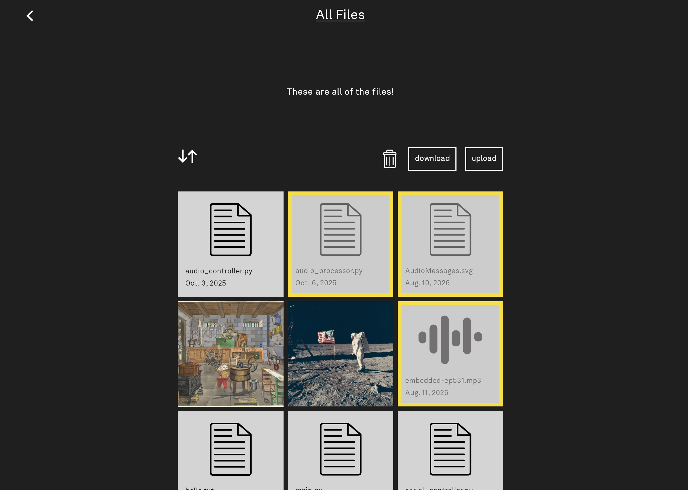

# Tool Manager

or: a local dash for getting stuff to and from your Light Phone



## tl;dr

This repo contains the source code for a full-stack web app - the Tool Manager (f.k.a PhotoBrowser, f.k.a FileManager) - that runs embedded within LightOS 
and provides a browser-based, dashboard-like UI to let users send/receive data/files to/from
various tools on their Light Phone. 

**SOON**: Tools developed using the [Light SDK](https://github.com/lightphone/light-sdk) will be
able to declare themselves as Tool Manager-capable, meaning users can securely and locally interact with those tools'
content from their PC. No cloud deployments necessary. Currently, all connections/transfers run via HTTP on the user's local network.

## Modules

- **[shared](./shared)** - Common data models shared across all modules.
- **[server](./server)** - Ktor server module with HTTP API routes and File I/O glue. Targets JVM and Android.
- **[composeApp](./composeApp)** - Compose Multiplatform client/frontend. Provides UI templates for tools to leverage.
- **[serverrunner](./serverrunner)** - Standalone JVM entry point for running the server locally with sample directories.

## Running Locally

Build and run the server on your PC:

```shell
./gradlew :serverrunner:run
```

The frontend is automatically built and bundled into the server resources. The URL to access the app
will be logged once running.

## TODOs
* Alt client/server builds that run over USB instead of WiFi/HTTP
* Desktop client apps? Could more easily do E2EE and auto-discover devices on the network.
* Our min SDK is 26 for Android builds but there are some minor runtime failures sitting in here.
* More templates?
  * One likely one is a "Settings" template that lets you input/edit some underlying structured data.
