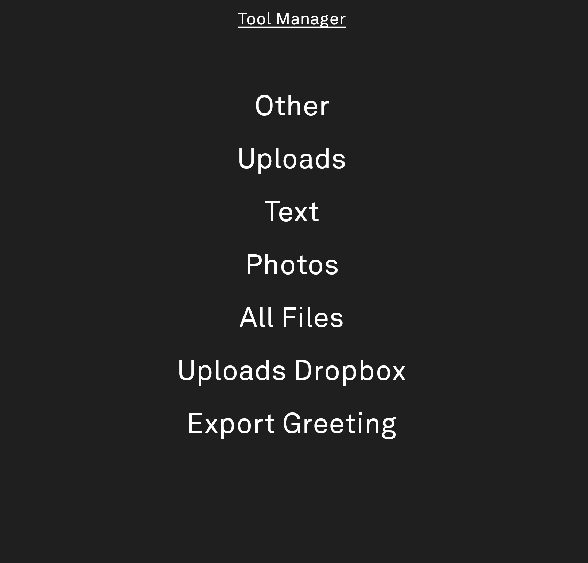
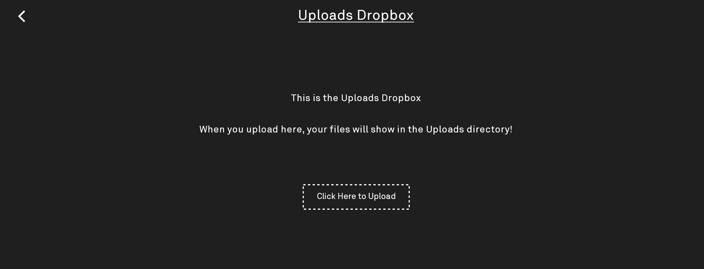

# Client

Compose Multiplatform frontend (JS/wasmJs for now) for the Tool Manager. Every page it can render is
driven by a `DataViewSpec` from
[shared](../shared/src/commonMain/kotlin/com/thelightphone/toolmanager/DataViewSpec.kt) — the
server hands back a tree of these (see server's
[DataTree & DataViews](../server/README.md#datatree--dataviews)), and `App.kt` dispatches each
one to a template based on its type.

## Templates

- **`RootViewSpec`** → [`RootScreen`](src/commonMain/kotlin/com/thelightphone/toolmanager/RootScreen.kt) —
  A page of links to child pages. Used for the root and any nested `RootViewSpec`.

  

- **`FileBrowserSpec`** → [`EntriesScreen`](src/commonMain/kotlin/com/thelightphone/toolmanager/EntriesScreen.kt) —
  The full file browser: paginated grid, thumbnails, multi-select download, upload, delete.

  

- **`UploadSpec`** → [`UploadScreen`](src/commonMain/kotlin/com/thelightphone/toolmanager/UploadScreen.kt) —
  A single upload target. Just a description and a button.

  

- **`DownloadSpec`** → [`DownloadScreen`](src/commonMain/kotlin/com/thelightphone/toolmanager/DownloadScreen.kt) —
  A single download target (`resourceFullPath`). The mirror image of `UploadSpec`.

  

- **`JobSpec`** -> [`JobScreen`](src/commonMain/kotlin/com/thelightphone/toolmanager/JobScreen.kt) —
  A place to kick off some arbitrary async work. When the button is hit, the job will be kicked off, and the frontend will poll its status until completion/failure.

- **`CustomSpec`** → No UI, this is for fetching data directly from the api.
